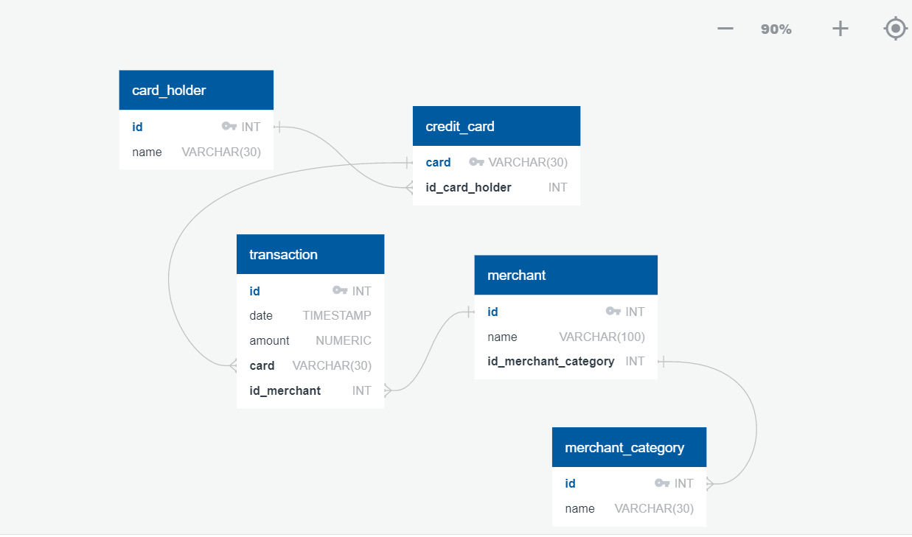
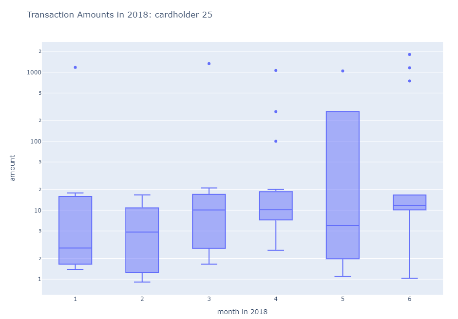

# Looking for Suspicious Transactions
### Homework 7: SQL

## **Data Modeling**

In this section, I created a database diagram to show the content of the available data inside each csv file and to show the relationships between between csv file contents.

## **Analysis using SQL**

- To isolate transactions of each card holder, I first had to join the cardholder, credit card, and transaction csv files using an inner join statement. Then I used a group by command to show the number of transactions for every unique cardholder. The highest number of transactions is from cardholder ID 16 with 221 transactions.

-Then I looked at the top 100 transactions that occurred from 7am to 9am. There seems to be around 10 anomalous transactions that have much higher amounts compared to the rest of the data. The highest transaction was $1,894 while the 100th highest transaction was $14.42. Also, It seems suspicious that someone would be spending $1,894 for breakfast at any of the food/beverage merchant categories we are looking at. In the future, we could use more statistics on the data to investigate those transactions further. 

-The next analysis involved looking at payments less than $2.00. cardholder ID 12 had the most number of transactions with less than $2.00 per transaction. I don't think there is enough evidence to show that this credit card has been hacked, this person could just be fond of buying bottled water from these food/beverage merchants. We would need more data to investigate this further. 

- Finally, the last section of the analysis looks at the top 5 merchants with payments less that $2.00. The merchant with the highest number of small transactions is Wood-Ramirez which has 7 transactions of less than $2.00.

## **Analysis using Pandas**

- In this section, I looked at the transactions of the biggest customers (cardholder 2 and 18). Below is a plot showing transactions for each cardholder over time. We can see that cardholder 18 may have some fraudulent transactions because of the spikes that we see in his consumption pattern and this should be investigated further.

- The last section shows the transactions of the firm's largest customer : cardholder 25. I created a six boxplots, each representing a month of transactions in 2018. We can see several outliers in many of the months which suggests that this card might have been compromised.

